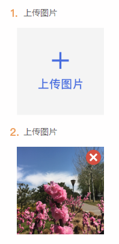

## Plupload 上传图片

> 一个[diyupload-webuploader](http://fex.baidu.com/webuploader/)上传图片的小demo

### 项目依赖

**在服务器下运行**

示例地址：http://localhost/webupload/index.html

依賴文件jquery、webuploader.min.js、fileupload.php、uploadfiles文件夹(存放上传的图片)

index.html、index.css

(其餘都是不需要的依賴)

### 演示步骤

点击上传界面图片才能上传，上传成功后如果想再次上传，需要点击删除按钮，先删除才能再次上传

### 其它

此demo单张单张上传，一共可传多张，js用变量接收，添加、删除是通过控制操作变量中每一项，每次上传接收服务器的返回链接，回显在相应位置，回显用了一个小技巧，覆盖一层假的图片显示出回显的数据！

**index.html页面的效果图（移动端）**

